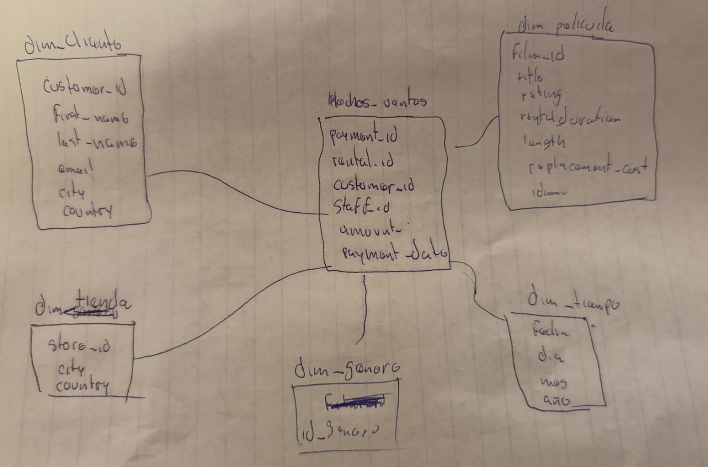
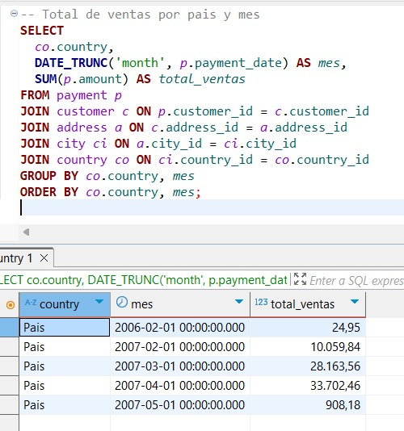
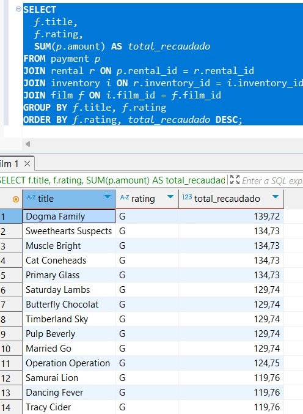
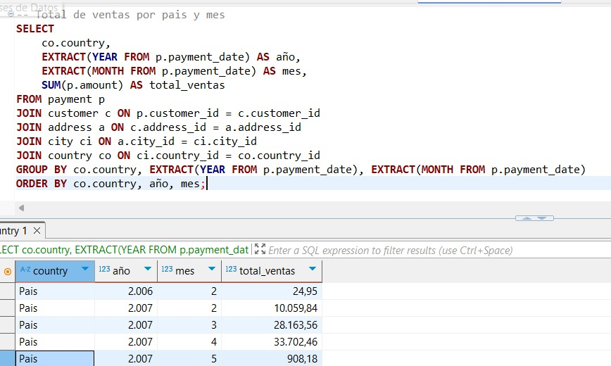

# Taller: Diseño de un Data Warehouse con ETL y esquemas Estrella/ Copo de Nieve. 

## Consultas

- Total de ventas por pais y mes
```sql
SELECT 
    co.country,
    EXTRACT(YEAR FROM p.payment_date) AS año,
    EXTRACT(MONTH FROM p.payment_date) AS mes,
    SUM(p.amount) AS total_ventas
FROM payment p
JOIN customer c ON p.customer_id = c.customer_id
JOIN address a ON c.address_id = a.address_id
JOIN city ci ON a.city_id = ci.city_id
JOIN country co ON ci.country_id = co.country_id
GROUP BY co.country, EXTRACT(YEAR FROM p.payment_date), EXTRACT(MONTH FROM p.payment_date)
ORDER BY co.country, año, mes;
```

- peliculas mas rentables por rating
```sql

SELECT 
  f.title,
  f.rating,
  SUM(p.amount) AS total_recaudado
FROM payment p
JOIN rental r ON p.rental_id = r.rental_id
JOIN inventory i ON r.inventory_id = i.inventory_id
JOIN film f ON i.film_id = f.film_id
GROUP BY f.title, f.rating
ORDER BY f.rating, total_recaudado DESC;
```


- peliculas mas rentables por rating
```sql
SELECT 
  f.title,
  f.rating,
  SUM(p.amount) AS total_recaudado
FROM payment p
JOIN rental r ON p.rental_id = r.rental_id
JOIN inventory i ON r.inventory_id = i.inventory_id
JOIN film f ON i.film_id = f.film_id
GROUP BY f.title, f.rating
ORDER BY f.rating, total_recaudado DESC;
```

- Ventas promedio por tienda
```sql
SELECT 
  s.store_id,
  ROUND(AVG(p.amount), 2) AS promedio_venta
FROM payment p
JOIN rental r ON p.rental_id = r.rental_id
JOIN inventory i ON r.inventory_id = i.inventory_id
JOIN store s ON i.store_id = s.store_id
GROUP BY s.store_id;
```

- Ventas totales por género
```sql
SELECT 
  cat.name AS genero,
  SUM(p.amount) AS total_ventas
FROM payment p
JOIN rental r ON p.rental_id = r.rental_id
JOIN inventory i ON r.inventory_id = i.inventory_id
JOIN film f ON i.film_id = f.film_id
JOIN film_category fc ON f.film_id = fc.film_id
JOIN category cat ON fc.category_id = cat.category_id
GROUP BY cat.name
ORDER BY total_ventas DESC;
```

- Promedio de gasto por cliente segun tienda, ciudad de la pelicula
```sql
SELECT 
  c.customer_id,
  s.store_id,
  ci.city,
  ROUND(AVG(p.amount), 2) AS promedio_gasto
FROM payment p
JOIN customer c ON p.customer_id = c.customer_id
JOIN rental r ON p.rental_id = r.rental_id
JOIN inventory i ON r.inventory_id = i.inventory_id
JOIN store s ON i.store_id = s.store_id
JOIN address a ON s.address_id = a.address_id
JOIN city ci ON a.city_id = ci.city_id
GROUP BY c.customer_id, s.store_id, ci.city
ORDER BY c.customer_id;
```

## Extraer 


 Hechos
Tabla: hechos_ventas

Datos extraídos: payment_id, customer_id, staff_id, amount, payment_date, rental_id

🔹 Dimensiones
dim_cliente: Datos del cliente, ciudad y país (de customer, address, city, country)

🔹dim_pelicula: Información de la película (film)

🔹dim_tiempo: Fecha extraída de payment_date

🔹dim_tienda: Ciudad y país de la tienda (store)

🔹dim_genero: Género de cada película (film_category, category)

## Transformaciones en SQL
- COMANDOS PARA LEVANTAR
- 1
```bash
docker cp transformaciones.sql bdavanzada-postgres:/transformaciones.sql
```
- 2
```bash
docker exec -it bdavanzada-postgres psql -U Adrian -d dvdrental -f /transformaciones.sql
```

## Cargado 

```sql
-- Tabla de hechos ventas
CREATE TABLE fact_ventas (
  payment_id INTEGER PRIMARY KEY,
  rental_id INTEGER,
  customer_id SMALLINT,
  staff_id SMALLINT,
  amount NUMERIC(10,2),
  payment_date DATE
);

-- Dimensión tiempo
CREATE TABLE dim_tiempo (
  fecha DATE PRIMARY KEY,
  dia SMALLINT,
  mes SMALLINT,
  anio SMALLINT
);

-- Dimensión cliente
CREATE TABLE dim_cliente (
  customer_id SMALLINT PRIMARY KEY,
  first_name VARCHAR(50),
  last_name VARCHAR(50),
  email VARCHAR(100),
  city VARCHAR(50),
  country VARCHAR(50)
);

-- Dimensión película
CREATE TABLE dim_pelicula (
  film_id SMALLINT PRIMARY KEY,
  title VARCHAR(255),
  rating VARCHAR(10),
  rental_duration SMALLINT,
  length SMALLINT,
  replacement_cost NUMERIC(10,2),
  idioma VARCHAR(50)
);

-- Dimensión género
CREATE TABLE dim_genero (
  film_id SMALLINT PRIMARY KEY,
  genero VARCHAR(50)
);

-- Dimensión tienda
CREATE TABLE dim_tienda (
  store_id INTEGER PRIMARY KEY,
  city VARCHAR(50),
  country VARCHAR(50)
);


INSERT INTO dim_tiempo (fecha, dia, mes, anio)
SELECT DISTINCT
  DATE(payment_date) AS fecha,
  EXTRACT(DAY FROM payment_date) AS dia,
  EXTRACT(MONTH FROM payment_date) AS mes,
  EXTRACT(YEAR FROM payment_date) AS anio
FROM payment;


INSERT INTO dim_cliente (customer_id, first_name, last_name, email, city, country)
SELECT DISTINCT
  c.customer_id,
  c.first_name,
  c.last_name,
  c.email,
  ci.city,
  co.country
FROM customer c
JOIN address a ON c.address_id = a.address_id
JOIN city ci ON a.city_id = ci.city_id
JOIN country co ON ci.country_id = co.country_id;


SELECT f.film_id, f.title, l.name AS idioma
FROM film f
LEFT JOIN language l ON f.language_id = l.language_id
LIMIT 10;


INSERT INTO dim_pelicula (film_id, title, rating, rental_duration, length, replacement_cost, idioma)
SELECT DISTINCT
  f.film_id,
  f.title,
  f.rating,
  f.rental_duration,
  f.length,
  f.replacement_cost,
  COALESCE(l.name, 'Desconocido') AS idioma
FROM film f
LEFT JOIN language l ON f.language_id = l.language_id;

```

## Explicacion del ETL paso a paso 
```bash
El proceso ETL (Extracción, Transformación, Carga) para el Data Warehouse de dvdrental comienza con la fase de Extracción, donde se recuperan datos de la base de datos dvdrental alojada en PostgreSQL. Esto implica extraer información de tablas como payment, rental, inventory, film, film_category, category, customer, address, city y country, que se unen mediante consultas SQL para poblar una tabla de Datos de Preparación. A continuación, en la fase de Transformación, los datos pasan por varios pasos: limpieza para eliminar valores NULL y duplicados, formateo de fechas para garantizar consistencia, generación de claves sustitutas para identificación única y unión de dimensiones para preparar los datos, resultando en una tabla de Datos de Preparación Actualizados. Finalmente, la fase de Carga popula el Data Warehouse de esquema Copo de Nieve, cargando datos en tablas de dimensiones normalizadas (Dim_Tiempo, Dim_Cliente, Dim_Ciudad_Cliente, Dim_Pais_Cliente, Dim_Tienda, Dim_Ciudad_Tienda, Dim_Pais_Tienda, Dim_Pelicula, Dim_Categoria, Dim_Idioma) con relaciones jerárquicas, y la tabla de hechos Fact_Ventas, que conecta estas dimensiones. Una vez cargados, los datos están listos para consultas OLAP que generan reportes como Ganancia por apuesta, Usuarios más activos, Ganancias del sistema vs usuarios y Cantidad de apuestas por día, proporcionando valiosas perspectivas a las 04:42 PM -04 del miércoles, 25 de junio de 2025.

```

## 

## Capturas de resultados 



