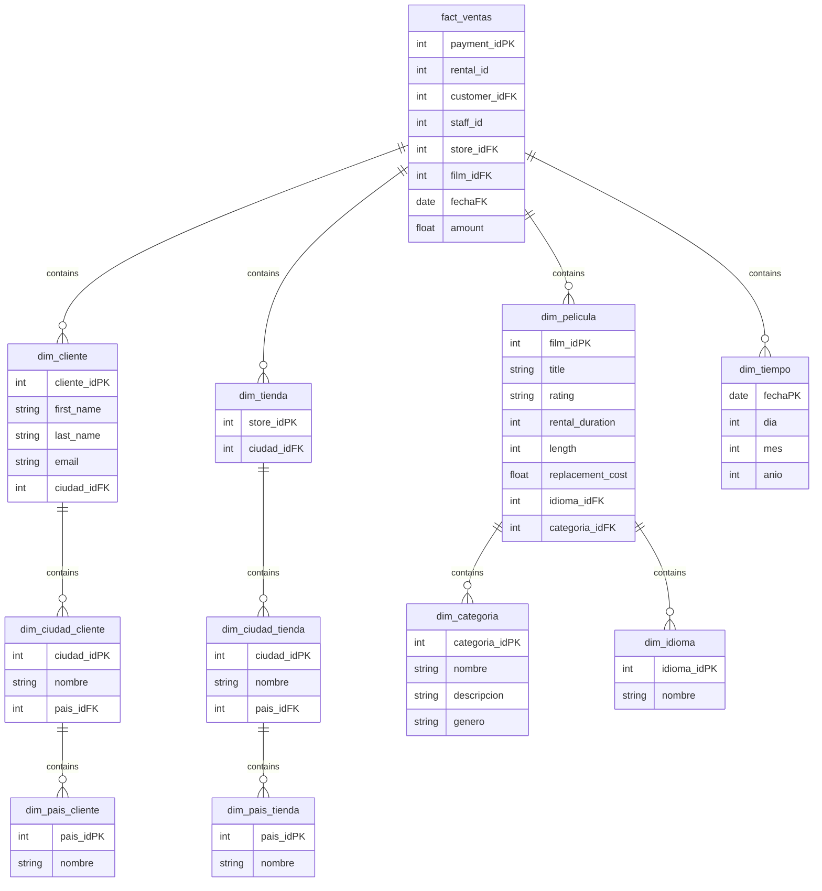

```mermaid
erDiagram
    fact_ventas ||--o{ dim_cliente : contains
    fact_ventas ||--o{ dim_tienda : contains
    fact_ventas ||--o{ dim_pelicula : contains
    fact_ventas ||--o{ dim_tiempo : contains

    dim_cliente ||--o{ dim_ciudad_cliente : contains
    dim_ciudad_cliente ||--o{ dim_pais_cliente : contains

    dim_tienda ||--o{ dim_ciudad_tienda : contains
    dim_ciudad_tienda ||--o{ dim_pais_tienda : contains

    dim_pelicula ||--o{ dim_categoria : contains
    dim_pelicula ||--o{ dim_idioma : contains

    fact_ventas {
        int payment_idPK
        int rental_id
        int customer_idFK
        int staff_id
        int store_idFK
        int film_idFK
        date fechaFK
        float amount
    }

    dim_cliente {
        int cliente_idPK
        string first_name
        string last_name
        string email
        int ciudad_idFK
    }

    dim_ciudad_cliente {
        int ciudad_idPK
        string nombre
        int pais_idFK
    }

    dim_pais_cliente {
        int pais_idPK
        string nombre
    }

    dim_tienda {
        int store_idPK
        int ciudad_idFK
    }

    dim_ciudad_tienda {
        int ciudad_idPK
        string nombre
        int pais_idFK
    }

    dim_pais_tienda {
        int pais_idPK
        string nombre
    }

    dim_pelicula {
        int film_idPK
        string title
        string rating
        int rental_duration
        int length
        float replacement_cost
        int idioma_idFK
        int categoria_idFK
    }

    dim_categoria {
        int categoria_idPK
        string nombre
        string descripcion
        string genero
    }

    dim_idioma {
        int idioma_idPK
        string nombre
    }

    dim_tiempo {
        date fechaPK
        int dia
        int mes
        int anio
    }

```