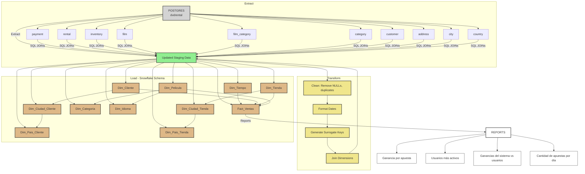

```mermaid
graph TD
    A[POSTGRES<br>dvdrental] -->|Extract| B[Staging Data]

    subgraph Extract
        A --> P1[payment]
        A --> P2[rental]
        A --> P3[inventory]
        A --> P4[film]
        A --> P5[film_category]
        A --> P6[category]
        A --> P7[customer]
        A --> P8[address]
        A --> P9[city]
        A --> P10[country]
        P1 & P2 & P3 & P4 & P5 & P6 & P7 & P8 & P9 & P10 -->|SQL JOINs| B
    end

    subgraph Transform
        B --> T1[Clean: Remove NULLs, duplicates]
        T1 --> T2[Format Dates]
        T2 --> T3[Generate Surrogate Keys]
        T3 --> T4[Join Dimensions]
        T4 --> B[Updated Staging Data]
    end

    subgraph Load - Snowflake Schema
        B --> D1[Dim_Tiempo]
        B --> D2[Dim_Cliente]
        B --> D3[Dim_Ciudad_Cliente]
        B --> D4[Dim_Pais_Cliente]
        B --> D5[Dim_Tienda]
        B --> D6[Dim_Ciudad_Tienda]
        B --> D7[Dim_Pais_Tienda]
        B --> D8[Dim_Pelicula]
        B --> D9[Dim_Categoria]
        B --> D10[Dim_Idioma]
        B --> D11[Fact_Ventas]

        D2 --> D3
        D3 --> D4
        D5 --> D6
        D6 --> D7
        D8 --> D9
        D8 --> D10
        D1 & D2 & D5 & D8 --> D11
    end

    D11 -->|Reports| H[REPORTS]
    H --> I1[Ganancia por apuesta]
    H --> I2[Usuarios más activos]
    H --> I3[Ganancias del sistema vs usuarios]
    H --> I4[Cantidad de apuestas por día]

    style A fill:#d3d3d3,stroke:#333,stroke-width:2px
    style B fill:#90ee90,stroke:#333,stroke-width:2px
    style T1 fill:#f0e68c,stroke:#333,stroke-width:2px
    style T2 fill:#f0e68c,stroke:#333,stroke-width:2px
    style T3 fill:#f0e68c,stroke:#333,stroke-width:2px
    style T4 fill:#f0e68c,stroke:#333,stroke-width:2px
    style D1 fill:#deb887,stroke:#333,stroke-width:2px
    style D2 fill:#deb887,stroke:#333,stroke-width:2px
    style D3 fill:#deb887,stroke:#333,stroke-width:2px
    style D4 fill:#deb887,stroke:#333,stroke-width:2px
    style D5 fill:#deb887,stroke:#333,stroke-width:2px
    style D6 fill:#deb887,stroke:#333,stroke-width:2px
    style D7 fill:#deb887,stroke:#333,stroke-width:2px
    style D8 fill:#deb887,stroke:#333,stroke-width:2px
    style D9 fill:#deb887,stroke:#333,stroke-width:2px
    style D10 fill:#deb887,stroke:#333,stroke-width:2px
    style D11 fill:#deb887,stroke:#333,stroke-width:2px
    style H fill:#fff,stroke:#333,stroke-width:2px
    style I1 fill:#fff,stroke:#333
    style I2 fill:#fff,stroke:#333
    style I3 fill:#fff,stroke:#333
    style I4 fill:#fff,stroke:#333
```