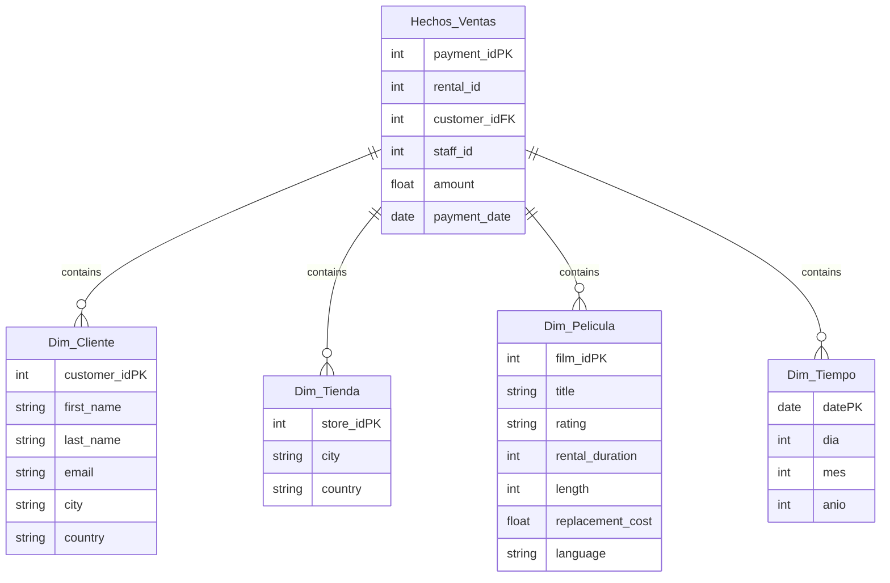

```mermaid
erDiagram
    Hechos_Ventas ||--o{ Dim_Cliente : contains
    Hechos_Ventas ||--o{ Dim_Tienda : contains
    Hechos_Ventas ||--o{ Dim_Pelicula : contains
    Hechos_Ventas ||--o{ Dim_Tiempo : contains

    Hechos_Ventas {
        int payment_idPK
        int rental_id
        int customer_idFK
        int staff_id
        float amount
        date payment_date
    }
    Dim_Cliente {
        int customer_idPK
        string first_name
        string last_name
        string email
        string city
        string country
    }
    Dim_Tienda {
        int store_idPK
        string city
        string country
    }
    Dim_Pelicula {
        int film_idPK
        string title
        string rating
        int rental_duration
        int length
        float replacement_cost
        string language
    }
    Dim_Tiempo {
        date datePK
        int dia
        int mes
        int anio
    }

```